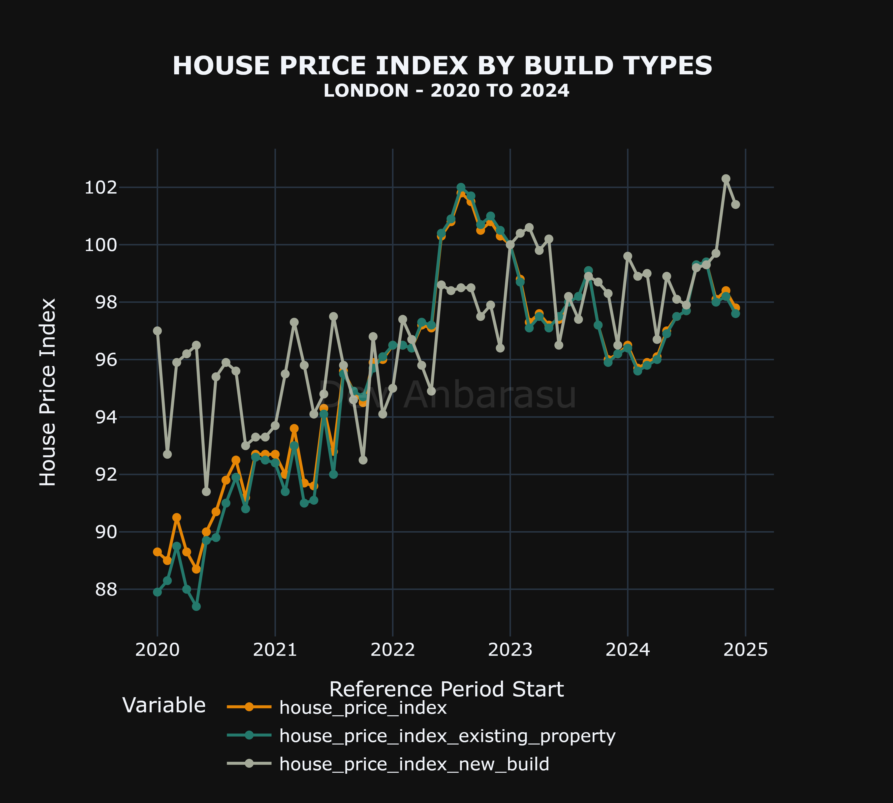

# UK House Price Index Dashboard

   

A Python toolkit and interactive Dash application for exploring the UK House Price Index (HPI) across geographies, time periods, and property characteristics. The project combines data ingestion utilities, caching/versioning helpers, and a gallery of ready-made Plotly visualisations.

## Table of Contents
- [Overview](#overview)
- [Features](#features)
- [Project Layout](#project-layout)
- [Getting Started](#getting-started)
- [Usage](#usage)
  - [Programmatic API](#programmatic-api)
  - [Regenerating Static Plots](#regenerating-static-plots)
  - [Launching the Dashboard](#launching-the-dashboard)
- [Sample Visual Gallery](#sample-visual-gallery)
- [Notebooks](#notebooks)
- [License](#license)
- [Author](#author)

## Overview

The UK Land Registry publishes the UK House Price Index (HPI) via SPARQL and REST endpoints. This repository wraps those services in a composable data toolkit:

- Ingest and normalise HPI series with a single Python API.
- Persist locally cached datasets for reproducible analysis runs.
- Generate high-quality Plotly figures for reporting.
- Explore insights interactively through a Dash dashboard optimised for quick comparisons across regions, property types, and buyer characteristics.

## Features

- **End-to-end data access**: `HousePriceIndex` (in `src/hpi.py`) builds SPARQL queries, fetches monthly series, and reshapes them into tidy data frames.
- **Caching and versioning**: `FileVersion` and `Dataset` utilities persist raw and processed data snapshots under `data/`, tagging each export with a timestamp (in `helper_utils/`).
- **Plot factory**: `HousePriceIndexPlots` exposes dozens of pre-configured Plotly express figures covering averages, index trends, annual change, and sales volumes.
- **Dash dashboard**: `dashboard/app_improved.py` ships a polished, themable app with region pickers, year sliders, and tabbed plot collections.
- **Geospatial helpers**: `src/geo_ops.py` and postcode lookup utilities simplify mapping and regional filtering workflows.
- **Automated assets**: `hpi_utils/image_generator.py` can regenerate the static chart gallery in batch.

## Project Layout

```text
uk_house_price_index/
├── dashboard/
│   ├── app_basic.py              # Minimal Dash starter
│   └── app_improved.py           # Production-ready dashboard (default entry point)
├── helper_utils/
│   ├── basic_plots.py            # Plot factories built on Plotly
│   ├── data_loader.py            # Dataset loader and serializer helpers
│   ├── data_version.py           # File versioning, caching, retention
│   ├── helper.py                 # Logging + shared tooling
│   ├── plotly_imports.py         # Shared Plotly theme/colour utilities
│   ├── response.py               # Wrapped HTTP response handling
│   └── split_from_camel.py       # String munging helpers
├── hpi_utils/
│   ├── data_collection.py        # Data gathering scripts
│   └── image_generator.py        # Batch exporter for gallery assets
├── images/                       # Generated Plotly figures (used in README/gallery)
├── postcode_lookups/             # Helper lookups and postcode level datasets
├── src/
│   ├── geo_ops.py                # Geography utilities for HPI datasets
│   ├── hpi.py                    # Core HPI fetch/transform/plot classes
│   ├── ppi.py                    # Price Paid Data utilities
│   └── sparql.py                 # SPARQL query builders
├── try_hpi.ipynb                 # Exploratory notebook
└── verify_hpi.py                 # Verification script
```

## Getting Started

Prerequisites:
- Python 3.11 (per `pyproject.toml`)
- Optional: [Poetry](https://python-poetry.org/) if you prefer managed environments

Clone and install:

```powershell
git clone https://github.com/<your-org>/uk_house_price_index.git
cd uk_house_price_index
python -m venv .venv
.venv\Scripts\activate
pip install --upgrade pip
pip install -e .
```

Alternative (Poetry):

```powershell
poetry install
poetry shell
```

The editable install exposes the package as `uk_house_price_index` so it can be imported from anywhere in your environment.

## Usage

### Programmatic API

```python
from uk_house_price_index.src.hpi import HousePriceIndex, HousePriceIndexPlots

hpi = HousePriceIndex()
# Build a tidy DataFrame for 2020-2024 West Northamptonshire HPI
results = hpi.fetch_hpi(start_year=2020, end_year=2024, region="west-northamptonshire")
# records = hpi.select_values(results) # (Internal method, usually handled by fetch_hpi wrapper if calling _fetch_hpi)
# Note: fetch_hpi now returns a DataFrame directly in the updated API.

# Generate pre-built Plotly figures
plots = HousePriceIndexPlots(start_year=2020, end_year=2024, region="west-northamptonshire")
fig = plots.plot_average_price_by_property_types()
fig.show()
```

- Regions are accepted as case-insensitive slugs (spaces become `-`).
- `HousePriceIndexPlots` lazily fetches data as needed and exposes methods prefixed with `plot_...`.
- All raw responses and processed frames can be persisted via `Dataset` helpers in `helper_utils/data_loader.py`.

### Regenerating Static Plots

To recreate the gallery under `uk_house_price_index/images/`:

```powershell
python -m uk_house_price_index.hpi_utils.image_generator
```

Each exported figure is saved with a timestamped suffix using `PlotSaver`, ensuring previously published visuals remain intact.

### Launching the Dashboard

The improved Dash application auto-opens a browser tab on port `8054`:

```powershell
python -m uk_house_price_index.dashboard.app_improved
```

Use the region dropdown, metric selectors, and year slider to explore different breakdowns. The `app_basic.py` module remains available as a lean alternative or a starting point for custom layouts.

## Sample Visual Gallery

### Average Price Views
   
   
 

### Index Levels
   
   
 

### Annual Change
   
   


### Transaction Volumes
 

## Notebooks

See `uk_house_price_index/try_hpi.ipynb` for a narrated walk-through of the API surface, including data extraction, cleaning, and visualisation examples.

## License

Apache License 2.0. See [`LICENSE`](LICENSE) for full text.

## Author

[Dev Anbarasu](https://github.com/daa2618)
